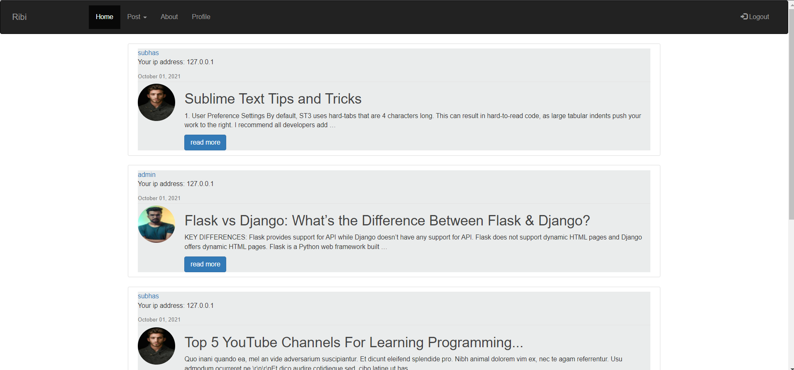
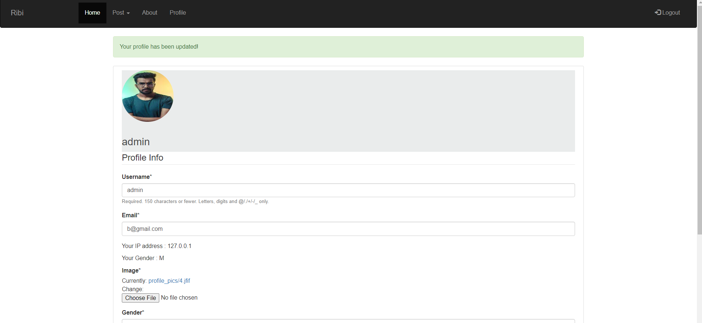

<div id="top"></div>


# Django_blog
## Django-blog is an open-source ecommerce platform built on the Django Web Framework.


# Demo
## Homepage

## Profilepage



<p align="right">(<a href="#top">back to top</a>)</p>

### Built With
 


<p align="right">(<a href="#top">back to top</a>)</p>

## Features Included

- Search Functionality
- add post
- delete post
- user authentication system
- user authorisation system
- user profile
- pagination 
- Much more...

<p align="right">(<a href="#top">back to top</a>)</p>

## Installation

**1.clone Repository & Install Packages**
```sh
git clone 
pip install -r requirements.txt
```
**2.Setup Virtualenv**
```sh
virtualenv env
source env/bin/activate
```
**3.Migrate & Start Server**
```sh
python manage.py makemigrations
python manage.py migrate
python manage.py runserver
```
<p align="right">(<a href="#top">back to top</a>)</p>

<!-- CONTRIBUTING -->
## Contributing

Contributions are what make the open source community such an amazing place to learn, inspire, and create. Any contributions you make are **greatly appreciated**.

If you have a suggestion that would make this better, please fork the repo and create a pull request. You can also simply open an issue with the tag "enhancement".
Don't forget to give the project a star! Thanks again!

1. Fork the Project
2. Create your Feature Branch (`git checkout -b feature/AmazingFeature`)
3. Commit your Changes (`git commit -m 'Add some AmazingFeature'`)
4. Push to the Branch (`git push origin feature/AmazingFeature`)
5. Open a Pull Request

<p align="right">(<a href="#top">back to top</a>)</p>


## Where to find Me
Like Me on [Facebook](https://www.facebook.com/biswajit.paloi.987/)
Or visit My [Website](https://github.com/biswajit955)

<p align="right">(<a href="#top">back to top</a>)</p>
